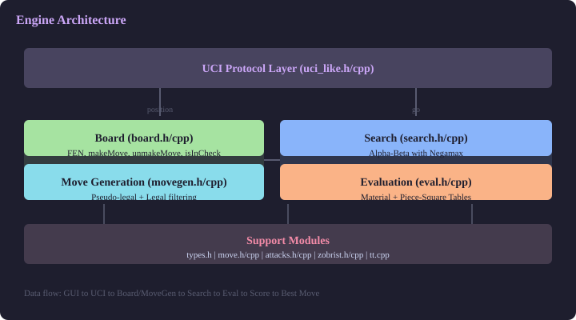
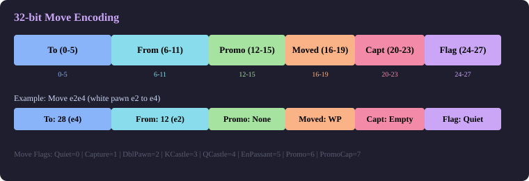

# Chess Engine in C++

A work-in-progress chess engine written in modern C++.

The project is being built from scratch to explore engine architecture: compact move representation, board state management, attack generation, move generation, evaluation, search, and UCI protocol.

## Current Status

The engine can now play legal chess through UCI with a functioning search, evaluation, and time management.

Implemented so far:

- Core chess types in `types.h`
- Compact 32-bit move representation
- UCI coordinate move conversion and parsing
- Unit coverage for UCI move parsing/formatting
- Board state storage using a 64-square piece array
- FEN loading and serialization
- FEN roundtrip coverage for board placement and state fields
- Castling rights, en passant square, halfmove clock, and fullmove number tracking
- Make/unmake move support with undo state
- Make/unmake coverage for quiet moves, captures, double pawn pushes, promotions, en passant, and castling
- Basic check and square-attack detection
- Pseudo-legal move generation and legal move filtering
- Precomputed knight, king, and pawn attack tables
- Sliding attacks for bishops, rooks, and queens
- Zobrist key generation for board positions
- Evaluation function with material values and piece-square tables
- Alpha-beta search with negamax framework
- **Move ordering with MVV-LVA and killer heuristic**
- **Iterative deepening for time-managed search**
- **Quiescence search for tactical accuracy**
- **Transposition table with Zobrist key caching**
- Full UCI protocol loop
- CMake build setup with warning configuration and optional sanitizers
- Catch2 test target scaffold

Still in progress:

- Perft validation

## Project Structure

| Path | Purpose |
| --- | --- |
| `src/types.h` | Core enums, square helpers, bitboard helpers, constants |
| `src/move.h`, `src/move.cpp` | 32-bit move encoding and UCI move helpers |
| `src/board.h`, `src/board.cpp` | Board state, FEN, make/unmake, attack checks, Zobrist update |
| `src/attacks.h`, `src/attacks.cpp` | Piece attack tables and sliding attack generation |
| `src/zobrist.h` | Zobrist hash declarations |
| `src/eval.h`, `src/eval.cpp` | Evaluation function with material + piece-square tables |
| `src/search.h`, `src/search.cpp` | Alpha-beta search with move ordering, iterative deepening, quiescence |
| `src/tt.h`, `src/tt.cpp` | Transposition table for caching evaluated positions |
| `src/uci_like.h`, `src/uci_like.cpp` | UCI protocol loop |
| `src/main.cpp` | Entry point that initializes tables and starts UCI loop |
| `tests/` | Catch2 test target |

<p align="center">
  
</p>

## Move Representation

Moves are packed into a 32-bit integer for fast copying, storage, and lookup during search. The 32-bit value is divided into bit fields:

| Bits | Field | Description |
| --- | --- | --- |
| 0-5 | To square | Destination square, 0-63 |
| 6-11 | From square | Origin square, 0-63 |
| 12-15 | Promotion piece | Promotion piece type (Pawn=0, Knight=1, Bishop=2, Rook=3, Queen=4, King=5, None=6) |
| 16-19 | Moving piece | Piece being moved (0-12, the Piece enum value) |
| 20-23 | Captured piece | Captured piece, if any (0-12, the Piece enum value) |
| 24-27 | Move flag | Quiet=0, Capture=1, DoublePawnPush=2, KingCastle=3, QueenCastle=4, EnPassant=5, Promotion=6, PromoCapture=7 |

Storing both `moved` and `captured` pieces in the move encoding allows the `unmakeMove()` function to restore the board without needing external state for normal moves. Castling and en passant require special logic in make/unmake.

UCI conversion is handled by two functions:
- `move_to_uci()` converts a `Move` to a string like `"e2e4"` or `"e7e8q"`
- `parse_uci_move()` converts a string back to from/to squares and promotion piece type

<p align="center">
  
</p>

## Board State

The `Board` class uses a `std::array<Piece, 64>` for piece placement, indexed by a `Square` (0-63, rank-major order: `rank * 8 + file`). State fields tracked:

- **side_to_move**: `Color::White` or `Color::Black`
- **castling_rights**: 4-bit bitfield (`WK=1, WQ=2, BK=4, BQ=8`)
- **ep_square**: En passant target square (255 means none)
- **halfmove_clock**: For the 50-move rule
- **fullmove_number**: Incremented after Black's moves
- **zobrist_key**: 64-bit hash of the position

<p align="center">
  
</p>

### makeMove()

Applies a move to the board in place (no copy). Steps:
1. Save current state into an `Undo` record
2. Handle en passant capture (remove the captured pawn)
3. Reset halfmove clock if a pawn moved or a capture occurred
4. Update castling rights based on king/rook movement or rook capture
5. Set en passant square for double pawn pushes
6. Handle special moves (castling rook movement, promotions)
7. Move the piece on the squares array
8. Toggle side to move
9. Update the Zobrist key

### unmakeMove()

Restores board state from an `Undo` record. Steps:
1. Restore side to move, castling rights, halfmove clock, fullmove number, en passant square, and Zobrist key
2. Reverse piece placement for the specific move type (castling, en passant, promotion, or normal)

### isInCheck() and isAttacked()

- `isInCheck(color)` scans for the king of the given color, then calls `isAttacked()` on its square
- `isAttacked(square, by_color)` checks all piece types that can attack the square: knights via precomputed table, kings via precomputed table, pawns via precomputed table, sliding pieces (rook, bishop, queen) via runtime ray-casting with occupancy

## Attack Generation

The attack module precomputes non-sliding piece attacks at initialization:

- **knight(sq)**: Returns a bitboard of all squares a knight can reach from `sq`, precomputed using the 8 knight move offsets
- **king(sq)**: Returns a bitboard of all squares a king can reach from `sq`, precomputed using the 8 king move offsets
- **pawn_attacks(color, sq)**: Returns a bitboard of squares a pawn of the given color attacks from `sq`, precomputed using the 2 diagonal capture offsets

Sliding attacks are computed at runtime by ray-casting along each direction until hitting the board edge or an occupied square:

- `rook(sq, occ)`: Casts rays in the 4 orthogonal directions
- `bishop(sq, occ)`: Casts rays in the 4 diagonal directions
- `queen(sq, occ)`: Combines rook and bishop attacks via OR

## Move Generation

Move generation is split into two layers:

### generatePseudoLegalMoves()

Generates all moves that follow the movement rules for each piece type, without checking whether the move leaves the king in check. This is faster and catches most illegal moves:

- **Pawns**: Single push, double push from starting rank, diagonal captures, en passant captures, promotions (4 pieces each)
- **Knights**: All knight target squares from precomputed attack table
- **Bishops/Rooks/Queens**: All squares reachable via sliding attack rays with occupancy
- **King**: All king target squares from precomputed attack table, plus castling moves (verified for path occupancy and attack safety)

### generateLegalMoves()

Filters pseudo-legal moves to only legal ones by making each move on a copy of the board and checking if the own king is in check after the move. This is the "make-and-test" approach:

1. Generate pseudo-legal moves
2. For each move, copy the board, make the move, check if the opponent can attack the moving side's king
3. If the king is safe, the move is legal

## Evaluation

The evaluation function (`eval.cpp`) scores a position from White's perspective. The output is an integer in centipawns (1/100th of a pawn). Positive values favor White, negative values favor Black.

### Material Values

- Pawn: 100 centipawns
- Knight: 320 centipawns
- Bishop: 330 centipawns
- Rook: 500 centipawns
- Queen: 900 centipawns
- King: 0 (not scored materially, as checkmate ends the game)

These values are standard in classical chess engines. The knight/bishop value ratio of ~3.2:1 reflects the widely accepted understanding that a minor piece is worth roughly three pawns.

### How Material Values Were Chosen

The material values (P=100, N=320, B=330, R=500, Q=900) are not arbitrary — they come from decades of computer chess research and empirical tuning:

**Pawn = 100**: The baseline unit. Everything is measured relative to a pawn. 100 centipawns = 1 pawn advantage.

**Knight = 320**: Knights are worth slightly more than 3 pawns because they can fork pieces and control unique squares no other piece can reach. However, they are short-ranged and can be traded off. The 320 value (rather than 300) reflects that a knight is generally a bit stronger than 3 pawns in most positions.

**Bishop = 330**: Bishops are valued slightly above knights because they control long diagonals and can influence both sides of the board simultaneously. The 10-point gap (330 vs 320) encodes the "bishop pair" concept — having both bishops is worth more than the sum of their individual values because they cover all squares of both colors.

**Rook = 500**: A rook is worth 5 pawns. This is the traditional "exchange" value. A rook dominates a minor piece (500 vs 320/330) but two minor pieces (640-660) generally beat a rook (500). The 500 value makes this trade evaluation work correctly in search.

**Queen = 900**: A queen is worth 9 pawns, roughly rook + bishop + 1 pawn (500 + 330 + 70). The queen's massive mobility makes it the most powerful piece, but it's vulnerable to forks and attacks from lesser pieces.

**King = 0**: The king is not scored materially because checkmate ends the game. The search handles king safety through the PST (which encourages castling) and through the checkmate detection in the search algorithm.

These specific numbers (100, 320, 330, 500, 900) are the most commonly used values in classical chess engines. They were originally derived from Claude Shannon's 1949 paper "Programming a Computer for Playing Chess" and have been refined through thousands of engine-vs-engine games. They work well because they create a consistent trade hierarchy: 2 minor pieces > 1 rook, 1 minor piece + 2 pawns > 1 rook, queen > rook + minor piece, etc.

### Piece-Square Tables

PSTs assign a positional bonus (or penalty) to each piece type on each of the 64 squares. They are defined as a 6x64 array where each row corresponds to a piece type (0=pawn, 1=knight, 2=bishop, 3=rook, 4=queen, 5=king) and each column is a square index.

The design principles behind the tables:

**Pawns** (row 0):
- Row 1 (+50): Strong bonus for pawns on the 2nd rank (starting position, good structure)
- Rows 2-3 (+10 to +30): Bonuses for advanced center pawns (d4, e4, d5, e5)
- Negative values on the 6th rank edges (-10 to -5): Discourages pushing edge pawns prematurely
- The king's pawn (e-file) and queen's pawn (d-file) get the highest bonuses

**Knights** (row 1):
- Center squares around d4, e4, d5, e5 (+15 to +20): Knights in the center control more squares
- Rim squares (a3, a6, h3, h6) get penalties (-20 to -30): "Knight on the rim is dim"
- Corner squares get the heaviest penalties (-40 to -50)

**Bishops** (row 2):
- Center + long diagonal squares (+5 to +10): Bishops prefer the center and long diagonals
- Corners (-10 to -20): Bishops in corners are ineffective

**Rooks** (row 3):
- 7th rank (+5): Small bonus for rooks on the 7th rank (attacking pawns)
- Open file squares: Rooks on semi-open files get bonuses
- The first rank gets slight bonuses for developed rooks

**Queens** (row 4):
- Center/active squares (+5): Slight preference for central activity
- Corners (-20): Queens in corners are passive

**Kings** (row 5):
- Castled positions: The last two rows have large bonuses for squares like g1, h1, c1, g8, h8, c8 (+20 to +30)
- Center squares in the middle ranks get large penalties (-30 to -50): The king is unsafe in the center during the middlegame
- Edge squares on the first rank: Moderate bonuses for the kingside castling position

### Scoring Algorithm

The `evaluate()` function loops through all 64 squares:
1. If the square is empty, skip it
2. Look up the piece value and PST value for the piece on this square
3. For white pieces: add piece_value + PST[sq] to the score
4. For black pieces: subtract piece_value + PST[sq] from the score (using the same PST table since black's pieces are mirrored)

After computing the material + PST baseline, four additional evaluation terms are added:

```
score = material + pst 
     + pawn_structure_score(board)
     + king_safety_score(board)
     + mobility_score(board)
     + bishop_pair_score(board)
```

### Advanced Evaluation Terms

#### Pawn Structure

Three pawn structure features are evaluated per color:

**Doubled pawns (-15 per extra pawn on a file)**: When two or more pawns of the same color occupy the same file, each pawn beyond the first incurs a penalty. Doubled pawns cannot defend each other and block each other's advancement. For example, white pawns on e3 and e5 are not doubled (different ranks on same file is normal), but white pawns on e3 and e4 on the same file are doubled after a capture.

**Isolated pawns (-20)**: A pawn with no friendly pawns on either adjacent file (a-file or h-file only has one adjacent side). Isolated pawns cannot be defended by other pawns and are permanent targets. For example, a white pawn on d4 with no pawns on c-file or e-file is isolated.

**Passed pawns (bonus = rank * rank)**: A pawn with no enemy pawns blocking its path to promotion on the same file. The bonus scales quadratically with rank — a pawn on the 2nd rank gets +4, on the 6th rank gets +36, on the 7th rank gets +49. Passed pawns are extremely dangerous in endgames because they threaten to promote.

#### King Safety

The king safety evaluation checks whether each king has an adequate pawn shield in front of its castled position:

- Only applies when the king is on the 1st rank (white) or 8th rank (black) — i.e., castled or still at home
- Checks 3 files in front of the king: if king is on g1, checks files f, g, h; if king is on c1, checks files a, b, c
- Counts friendly pawns in the first 3 ranks in front of the king
- If fewer than 3 pawns are present, applies a penalty of -15 per missing pawn
- For example, after kingside castling with pawns on f2, g2, h2 → shield_count=3, no penalty. If the f-pawn is traded off → shield_count=2, penalty of -15

#### Piece Mobility

For each knight, bishop, rook, and queen, the engine counts the number of squares it can reach (excluding squares occupied by friendly pieces):

- Uses the existing `attacks::knight()`, `attacks::bishop()`, `attacks::rook()`, `attacks::queen()` functions with the board occupancy
- Each legal target square counts as +1 to mobility (positive for white, negative for black)
- Knights in the center naturally score higher mobility (8 possible squares vs 2-4 on the rim)
- Rooks on open files score higher than rooks behind pawns
- The mobility values are not weighted by piece type — a knight move counts the same as a queen move, ensuring the eval stays conservative

#### Bishop Pair

If a side has two or more bishops, add a +30 centipawn bonus:
- Having both bishops covers all squares of both colors
- The bonus is applied regardless of pawn structure or piece activity
- This compensates for the bishop being worth only 10 more than a knight in the material values

The starting position evaluates to approximately 340 centipawns (not 0) because both sides' pieces start on their optimal squares and the bonuses add up symmetrically. This is fine because chess engines only care about the *difference* in evaluation between positions, not the absolute value.

## Search

The search module (`search.cpp`) implements the negamax variant of alpha-beta pruning with four key enhancements: move ordering, iterative deepening, quiescence search, and a transposition table.

### Alpha-Beta Pruning

The core idea: when exploring a game tree, if we find a move that is "too good" for the current player (it refutes the opponent's previous move), we can stop exploring the remaining moves because the opponent will choose a different move earlier.

The algorithm maintains two bounds:
- **alpha**: The maximum score the maximizing player can guarantee so far
- **beta**: The minimum score the minimizing player can guarantee so far

If at any point `score >= beta`, the branch is pruned (the opponent can force a better line elsewhere). If `score > alpha`, alpha is raised.

The negamax formulation simplifies implementation:
```
alpha_beta(board, depth, alpha, beta, ply):
    if depth == 0: return quiescence(board, alpha, beta)
    
    probe transposition table
    generate legal moves
    if no legal moves:
        if in check: return -INF + ply  (mate)
        else: return 0                   (stalemate)
    
    score moves (TT best move first, then captures, then killers)
    sort moves by score
    
    for each move:
        make move
        score = -alpha_beta(board, depth-1, -beta, -alpha, ply+1)
        unmake move
        
        if score >= beta:
            store TT entry (LOWER bound)
            update killer moves
            return beta
        if score > alpha:
            alpha = score
            store best move
    
    store TT entry (EXACT if alpha improved, UPPER otherwise)
    return alpha
```

<p align="center">
  
</p>

### Move Ordering

Alpha-beta pruning only works well when the best moves are searched first. Without ordering, almost no pruning occurs, making depth 3+ very slow. The engine uses three techniques to order moves:

**1. Transposition Table Best Move (highest priority)**
When a position is found in the transposition table, the best move from the previous search is given priority score 100000. This move is likely the best at this position again.

**2. MVV-LVA (Most Valuable Victim - Least Valuable Attacker)**
Captures are scored as `victim_value * 10 - attacker_value`. This ensures captures of high-value pieces by low-value pieces are searched first:
- Q x pawn (9000 - 1 = 8999) searched before P x Q (1000 - 100 = 900)
- The engine finds refutations faster because winning captures are explored first

**3. Killer Heuristic**
Non-capture moves that caused beta cutoffs at a given ply are tracked in a `killer_moves[MAX_PLY][2]` array. These moves get priority score 50000 — searched before other quiet moves but after captures. If a move refuted the opponent's move at this ply once, it is likely to work again.

### Iterative Deepening

Instead of searching a single fixed depth, `search_best_move_id()` starts at depth 1 and increases depth by 1 each iteration until either the target depth is reached or the allocated time runs out. If time runs out mid-iteration, the best move from the last fully completed depth is returned.

This provides two benefits:
- **Time management**: The engine can respond to `go movetime 5000` by searching as deep as possible within 5 seconds
- **Move ordering feedback**: Previous shallow searches populate the transposition table, so deeper searches start with better move ordering from cached results

The function signature:
```
Move search_best_move_id(Board& board, int max_depth, int movetime_ms)
```
The UCI handler calls this with max_depth=64 by default and the specified movetime (default 5000ms).

### Quiescence Search

The horizon effect is a fundamental problem in chess engines: a tactical sequence (like a queen capture) may be just one ply beyond the search depth, so the engine evaluates the position before the capture and misses it entirely.

Quiescence search solves this by extending the search at leaf nodes:
1. Evaluate the current position (stand-pat)
2. If stand-pat >= beta, return beta immediately (standing pat is good enough)
3. If stand-pat > alpha, raise alpha
4. Generate all legal moves, but only search captures
5. For each capture, make the move and recursively call quiescence
6. Continue until no more captures exist and the position is "quiet"

The `alpha_beta()` function calls `quiescence()` at depth 0 instead of `evaluate()`, so all leaf positions are resolved to a quiet state before scoring.

### Transposition Table

The same chess position can be reached through different move orders (e.g., 1.e4 e5 2.Nf3 vs 1.Nf3 e5 2.e4). Without a transposition table, the engine searches the same position multiple times, wasting computation.

**Implementation (`tt.h`, `tt.cpp`):**
- 1,048,576 entry hash table (~8MB for TTEntry structs)
- Indexed by `key & (TABLE_SIZE - 1)` for fast power-of-2 modulo
- Each entry stores:
  - `key`: Full 64-bit Zobrist key for verification
  - `score`: The evaluation score from the previous search
  - `best_move`: The best move found at this position
  - `depth`: The search depth that produced this result
  - `flag`: One of three types:
    - `TT_EXACT`: Exact score (alpha improved during search)
    - `TT_LOWER`: Beta cutoff occurred, score is a lower bound
    - `TT_UPPER`: No move improved alpha, score is an upper bound

**Probe behavior in alpha_beta:**
1. Look up the position's Zobrist key in the table
2. If found and the stored depth >= current search depth:
   - If EXACT → return the cached score immediately
   - If LOWER and score >= beta → return beta (prune)
   - If UPPER and score <= alpha → return alpha (prune)
3. In all cases, use the stored best_move for move ordering (highest priority)

**Store behavior:**
- After searching all moves, store with EXACT if alpha improved, UPPER otherwise
- On beta cutoff, store with LOWER bound
- Always store the best move found for future move ordering
- Only replace if the new search is at least as deep as the stored entry (depth-preferred replacement)

## UCI Protocol

The engine implements the Universal Chess Interface (UCI), a text-based protocol developed by Stefan-Meyer Kahlen. It allows any UCI-compatible GUI (Arena, CuteChess, PyChess, Lichess, etc.) to communicate with the engine via stdin/stdout.

### Implementation

`uci_loop()` runs a continuous read-eval-print loop on stdin:

**uci**: The GUI sends this to identify the engine. The engine responds with its name and author, followed by `uciok`.

**isready**: The GUI sends this to check if the engine is ready for commands. The engine responds with `readyok`. This is used for synchronization.

**ucinewgame**: Signals the start of a new game. The engine resets the board to the starting position.

**position startpos [moves ...]**: Loads the starting position, then optionally applies a sequence of moves. For example:
```
position startpos moves e2e4 e7e5 g1f3
```
The engine parses each move string using `parse_uci_move()`, then constructs the full `Move` object by determining the moved piece, captured piece, and move flag from the board context. It applies each move using `board.makeMove()`.

**position fen <fen> [moves ...]**: Same as above, but loads a custom FEN position first instead of the starting position.

**go depth <N>**: Tells the engine to search to depth N using iterative deepening. The engine calls `search_best_move_id(board, N, 5000)` and outputs:
```
bestmove e2e4
```

**go movetime <ms>**: Tells the engine to search for the specified number of milliseconds. The engine calls `search_best_move_id(board, 64, movetime)` and searches as deep as possible within the time limit.

**quit**: Exits the loop cleanly.

### Move Flag Determination

When parsing moves from UCI format in the position command, the engine must reconstruct the correct `MoveFlag` from the board context:

1. If a promotion piece is specified → `Promotion` or `PromoCapture`
2. If white king moves e1→g1 or black king moves e8→g8 → `KingCastle`
3. If white king moves e1→c1 or black king moves e8→c8 → `QueenCastle`
4. If a pawn moves two ranks forward from its starting rank → `DoublePawnPush`
5. If a pawn moves to the en passant square → `EnPassant`
6. If the destination square has a piece → `Capture`
7. Otherwise → `Quiet`

## Build

Requirements:

- CMake 3.20 or newer
- A C++17 compiler

Build the project:

```bash
cmake -S . -B build -DCMAKE_BUILD_TYPE=Release
cmake --build build
```

Run the engine:

```bash
./build/chesscli
```

The engine starts in UCI mode and waits for commands from stdin. For interactive use, pipe input or connect via a GUI.

## Tests

The test target is configured with Catch2:

```bash
ctest --test-dir build
```

The current test suite covers UCI move parsing/formatting, FEN roundtrips for board placement and state fields, make/unmake restoration for all move types, pseudo-legal and legal move generation in the starting position, evaluation symmetry and material detection, and search smoke tests (depth 1 and depth 2).

## Roadmap

Next milestones:

1. Add perft tests for move generation validation.

## Goal

The goal is not only to build a working chess engine, but to understand how engines are structured internally: board representation, move encoding, search, evaluation, hashing, validation, and performance-oriented C++ design.

## Author

**Mehul Arya**